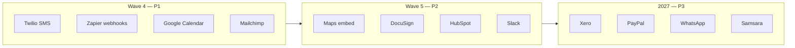

# Innexar Field — Roadmap de Integrações

> Planejamento de integrações externas para aumentar valor do produto (receita, retenção, operação diária).  
> Related: [Canvas gaps](./canvas-gaps.md) · [Context map](../domain/context-map.md) · [ADR-0004 Resilience](../adr/0004-resilience-integrations.md) · Last reviewed: 2026-06-26.

---

## English summary

FieldForge (Innexar Field) ships **Stripe** (SaaS billing + Connect), **QuickBooks OAuth** (invoice export, mock without live keys), **Avalara** (tax calculate stub), **SMTP** (transactional email via platform settings), and **Cloudflare R2** (multipart uploads). Wave 4 prioritizes **Tier 1** integrations that unlock daily ops: **Twilio SMS**, **Google Calendar** two-way sync, **Zapier/Make** outbound webhooks, and **Mailchimp** list sync — all behind the existing `packages/integrations/` ACL with tenant-scoped credentials. **Tier 2** adds maps embed, DocuSign, HubSpot, and Slack. **Tier 3** covers Xero, PayPal, WhatsApp Business, and Samsara fleet GPS for larger tenants and international expansion.

**Architecture rule:** external vendors live in Anti-Corruption Layer adapters (`packages/integrations/` + thin hooks in domain plugins). Connection state persists in `tenant_integrations`; secrets via `billing.SecretResolver` / platform settings — never client-only headers.

---

## Propósito

Este documento complementa a [análise de gaps do canvas](./canvas-gaps.md) com um plano de integrações **priorizado por valor de negócio**, esforço estimado e **fronteira de plugin** (onde o código deve viver). Objetivo: aumentar receita (pagamentos, conversão), retenção (comunicação proativa) e eficiência operacional (calendário, automações, contabilidade).

**Legenda de prioridade**

| Prioridade | Significado | Horizonte sugerido |
|------------|-------------|-------------------|
| **P1** | Bloqueia valor diário ou receita imediata | Wave 4 (Q3 2026) |
| **P2** | Diferencial competitivo; não bloqueia MVP | Wave 5 (Q4 2026) |
| **P3** | Expansão, mercados adjacentes ou enterprise | 2027+ |

**Estimativa de esforço:** semanas de 1 dev full-stack + revisão QA, incluindo ACL, UI em `/settings/integrations`, testes de tenant isolation e documentação OpenAPI. Integrações com OAuth ou webhooks bidirecionais ficam no topo da faixa.

---

## Estado atual (shipped / partial)

| Integração | Escopo | Pacote / rota | Maturidade | Notas |
|------------|--------|---------------|------------|-------|
| **Stripe — SaaS billing** | Checkout pós-signup, dunning, webhooks, portal de assinatura | `packages/core/billing/` | **partial → production path** | `UseMockStripe()` desliga mock quando há secret em env ou `platform_settings` |
| **Stripe Connect** | Onboarding tenant, pagamentos portal cliente | `packages/integrations/stripeconnect.go` | **partial** | Mock gated; Connect UX e webhooks de payout pendentes de polish |
| **QuickBooks Online** | OAuth start/callback, export invoice | `packages/integrations/quickbooks.go` | **partial** | Fluxo OAuth implementado; sync contínuo e produção sem keys = mock |
| **Avalara AvaTax** | Cálculo de imposto US em quotes/invoices | `packages/integrations/avalara.go` | **stub** | Taxa mock configurável (`mock_rate_percent`); fila manual em falha (ADR-0004) |
| **SMTP** | Email transacional (templates, propostas, notificações) | `packages/plugins/communications/email.go`, `platform_settings.smtp` | **partial** | Modo `log` em dev; produção via SMTP platform-wide ou tenant |
| **R2 / S3 storage** | Upload multipart, fotos QC, daily logs | `packages/core/storage/` | **partial** | R2 via env; fallback local em dev |

**Hub existente:** `GET /integrations/`, `GET /integrations/status`, UI em `/settings/integrations` e `apps/admin` platform integrations. Catálogo declarado em `config/app.config.yaml` → `integrations:`.

---

## Tier 1 — Alto valor (P1)

Integrações que fecham gaps P1 do [canvas-gaps](./canvas-gaps.md): comunicações SMS, agendamento bidirecional, automações no ecossistema do cliente e marketing básico.

### Twilio SMS

| Campo | Detalhe |
|-------|---------|
| **Valor para o usuário** | Confirmações de job, lembretes 24h, “on my way”, cobrança de proposta por SMS, 2FA opcional para portal cliente — reduz no-shows e acelera resposta vs email. |
| **Esforço** | **2–3 semanas** — adapter Twilio, templates SMS em communications, delivery webhooks, opt-out/compliance TCPA. |
| **Fronteira de plugin** | **ACL:** `packages/integrations/twilio.go` (send, status callback). **Domínio:** `packages/plugins/communications/` (templates, variáveis, preferências). **Eventos:** `job.scheduled`, `estimate.sent` → outbox → SMS. |
| **Prioridade** | **P1** |

### Google Calendar

| Campo | Detalhe |
|-------|---------|
| **Valor para o usuário** | Sync bidirecional jobs/recurring ↔ calendário Google do técnico ou dispatcher; evita double-booking; cliente vê disponibilidade real no portal. |
| **Esforço** | **3–4 semanas** — OAuth Google, sync incremental, conflict resolution, webhook push notifications. |
| **Fronteira de plugin** | **ACL:** `packages/integrations/googlecalendar.go`. **Domínio:** `packages/plugins/scheduling/` (events, recurring rules). **Web:** indicador sync em `/schedule`. |
| **Prioridade** | **P1** |

### Zapier / Make (webhooks outbound)

| Campo | Detalhe |
|-------|---------|
| **Valor para o usuário** | Tenant conecta FieldForge a 5.000+ apps sem custom dev: novo lead → CRM externo, job completed → planilha, invoice paid → Slack/email. |
| **Esforço** | **2 semanas** — assinatura HMAC de webhooks, retry + dead letter, UI de endpoints e event catalog. |
| **Fronteira de plugin** | **Core:** `packages/core/events/` (publicar payloads versionados). **ACL leve:** `packages/integrations/webhooks.go` ou extensão do hub. **Sem plugin novo** — feature flag `integrations.outbound_webhooks`. |
| **Prioridade** | **P1** |

### Mailchimp

| Campo | Detalhe |
|-------|---------|
| **Valor para o usuário** | Sync de leads/clientes para campanhas de reativação, newsletters pós-serviço, NPS — marketing recorrente sem export CSV manual. |
| **Esforço** | **2 semanas** — OAuth/API key, mapeamento audience ↔ customer, sync on `customer.created` / tag rules. |
| **Fronteira de plugin** | **ACL:** `packages/integrations/mailchimp.go`. **Domínio:** `packages/plugins/crm/` (tags, consent). **Opcional:** hook em `communications` para transactional vs marketing separation. |
| **Prioridade** | **P1** |

---

## Tier 2 — Diferencial competitivo (P2)

Melhoram UX premium, vendas e colaboração interna; alinhadas a Wave 5 e itens “honorable mention” do gap doc.

### Google Maps API (embed)

| Campo | Detalhe |
|-------|---------|
| **Valor para o usuário** | Mapa ao vivo no dispatch board e schedule map (hoje só deep links em `apps/web/lib/maps.ts`); visualização de rotas e ETAs para dispatcher. |
| **Esforço** | **1–2 semanas** — Maps JavaScript API embed, API key por tenant ou platform, rate limits. |
| **Fronteira de plugin** | **Frontend:** `apps/web/components/maps/` + env `NEXT_PUBLIC_GOOGLE_MAPS_KEY`. **Backend mínimo:** proxy opcional para Geocoding em `packages/integrations/googlemaps.go`. **Domínio:** `scheduling`, `dispatch` (somente leitura de coordenadas já persistidas). |
| **Prioridade** | **P2** |

### DocuSign

| Campo | Detalhe |
|-------|---------|
| **Valor para o usuário** | Assinatura eletrônica em propostas e contratos de serviço; acelera quote→job e compliance em construction. |
| **Esforço** | **3 semanas** — envelope create, embedded signing, webhook `envelope.completed` → `quote.accepted`. |
| **Fronteira de plugin** | **ACL:** `packages/integrations/docusign.go`. **Domínio:** `packages/plugins/estimating/` (proposals) + `crm` (contracts). **Storage:** PDF assinado → R2. |
| **Prioridade** | **P2** |

### HubSpot

| Campo | Detalhe |
|-------|---------|
| **Valor para o usuário** | Sync leads e deals para equipes que já operam HubSpot; evita duplicar pipeline de vendas. |
| **Esforço** | **3 semanas** — OAuth, contact/deal sync, property mapping configurável. |
| **Fronteira de plugin** | **ACL:** `packages/integrations/hubspot.go`. **Domínio:** `packages/plugins/crm/` (leads, activities). |
| **Prioridade** | **P2** |

### Slack (notificações)

| Campo | Detalhe |
|-------|---------|
| **Valor para o usuário** | Alertas operacionais no canal da empresa: job atrasado, pagamento recebido, support ticket portal — sem abrir o ERP. |
| **Esforço** | **1–2 semanas** — Incoming Webhook ou Slack App OAuth, preferências por evento. |
| **Fronteira de plugin** | **ACL:** `packages/integrations/slack.go`. **Core:** `packages/core/notifications/` (fan-out channel). |
| **Prioridade** | **P2** |

---

## Tier 3 — Expansão e enterprise (P3)

Mercados adjacentes, pagamentos alternativos, messaging global e fleet telematics.

### Xero

| Campo | Detalhe |
|-------|---------|
| **Valor para o usuário** | Contabilidade para tenants US/internacionais que preferem Xero vs QuickBooks; export invoices/payments. |
| **Esforço** | **4 semanas** — reutilizar padrão QB OAuth + mappers; chart of accounts mapping. |
| **Fronteira de plugin** | **ACL:** `packages/integrations/xero.go`. **Domínio:** `packages/plugins/accounting/` (read models). |
| **Prioridade** | **P3** |

### PayPal

| Campo | Detalhe |
|-------|---------|
| **Valor para o usuário** | Método de pagamento alternativo no portal cliente e links de invoice; relevante para B2C cleaning. |
| **Esforço** | **3 semanas** — PayPal Checkout + webhooks; reconciliação com AR. |
| **Fronteira de plugin** | **ACL:** `packages/integrations/paypal.go`. **Domínio:** `packages/plugins/invoicing/` + portal payments. |
| **Prioridade** | **P3** |

### WhatsApp Business

| Campo | Detalhe |
|-------|---------|
| **Valor para o usuário** | Mensagens proativas e suporte async onde SMS/email têm baixa abertura; comum em mercados LATAM. |
| **Esforço** | **4 semanas** — Meta Cloud API, templates aprovados, opt-in, custo por mensagem. |
| **Fronteira de plugin** | **ACL:** `packages/integrations/whatsapp.go`. **Domínio:** `communications` + `portal/messages`. |
| **Prioridade** | **P3** |

### GPS fleet — Samsara

| Campo | Detalhe |
|-------|---------|
| **Valor para o usuário** | Posição ao vivo de veículos, geofence chegada/saída job site, integração com dispatch ETA — substitui stub `/m/vehicle`. |
| **Esforço** | **4–5 semanas** — API Samsara, polling/webhooks, plugin `fleet` data model. |
| **Fronteira de plugin** | **ACL:** `packages/integrations/samsara.go`. **Novo/expandido:** plugin `fleet` (veículos, telemetria). **Domínio:** `dispatch`, `scheduling`. |
| **Prioridade** | **P3** |

---

## Matriz resumo

| Integração | Tier | Prioridade | Esforço (sem.) | ACL (`packages/integrations/`) | Plugin / core consumidor |
|------------|------|------------|------------------|----------------------------------|---------------------------|
| Twilio SMS | 1 | P1 | 2–3 | `twilio.go` | communications, notifications |
| Google Calendar | 1 | P1 | 3–4 | `googlecalendar.go` | scheduling |
| Zapier/Make webhooks | 1 | P1 | 2 | `webhooks.go` / core events | core/events, todos plugins |
| Mailchimp | 1 | P1 | 2 | `mailchimp.go` | crm, communications |
| Google Maps embed | 2 | P2 | 1–2 | `googlemaps.go` (opcional) | scheduling, dispatch, web |
| DocuSign | 2 | P2 | 3 | `docusign.go` | estimating, crm, storage |
| HubSpot | 2 | P2 | 3 | `hubspot.go` | crm |
| Slack | 2 | P2 | 1–2 | `slack.go` | notifications |
| Xero | 3 | P3 | 4 | `xero.go` | accounting |
| PayPal | 3 | P3 | 3 | `paypal.go` | invoicing, portal |
| WhatsApp Business | 3 | P3 | 4 | `whatsapp.go` | communications, portal |
| Samsara fleet GPS | 3 | P3 | 4–5 | `samsara.go` | fleet (novo), dispatch |

**Esforço total estimado (Tier 1–3):** ~32–38 semanas sequenciais; **~12–14 semanas** se Tier 1 for paralelizado com 2 devs.

---

## Ordem de implementação recomendada

1. **QuickBooks + Stripe Connect production** (já em Wave 4 do canvas-gaps) — base de confiança contábil/pagamentos.
2. **Twilio + Zapier** — desbloqueiam comunicação e automação com menor superfície OAuth.
3. **Google Calendar** — depende de scheduling estável (recurring + assign).
4. **Mailchimp** — após consent/tags em CRM.
5. Tier 2 em paralelo com polish portal e PDF email attachment.

---

## Sugestões de nós para o catálogo do canvas

Texto sugerido para novos ou atualizados módulos na aba **Catalogo** de `docs/canvases/erp-field-services-plan.canvas.tsx` (`FULL_CATALOG`). Não altera código até PR dedicado.

### Atualizar `integrations-hub` (Plataforma e Core)

| Campo | Valor sugerido |
|-------|----------------|
| **status** | `expand` (era `new`) |
| **features** | `QuickBooks OAuth, Stripe Connect, Avalara tax, Twilio SMS, Google Calendar, Zapier webhooks, Mailchimp, Slack — tenant_integrations + ACL` |
| **weeks** | `6` (hub + Tier 1) |

### Atualizar `communications` (CRM e Clientes)

| Campo | Valor sugerido |
|-------|----------------|
| **status** | `expand` |
| **features** | `SMTP templates v1, Twilio SMS P1, WhatsApp P3, automações event-driven, TCPA opt-out` |
| **weeks** | `3` |

### Atualizar `fleet` (Operações e Campo)

| Campo | Valor sugerido |
|-------|----------------|
| **features** | `Veículos, fuel log, GPS deep links v1, Samsara telematics P3, geofence job site` |
| **weeks** | `4` |

### Novo módulo — `integrations-automation` (Plataforma e Core)

| Campo | Valor sugerido |
|-------|----------------|
| **name** | `integrations-automation` |
| **status** | `new` |
| **features** | `Outbound webhooks HMAC, Zapier/Make, event catalog, retry DLQ` |
| **weeks** | `2` |

### Novo módulo — `e-signature` (Compliance e RH) ou expandir `proposals`

| Campo | Valor sugerido |
|-------|----------------|
| **name** | `e-signature` |
| **status** | `new` |
| **features** | `DocuSign envelopes, embedded sign, webhook → quote.accepted, PDF arquivado R2` |
| **weeks** | `3` |

### Novo módulo — `maps-live` (Operações e Campo)

| Campo | Valor sugerido |
|-------|----------------|
| **name** | `maps-live` |
| **status** | `new` |
| **features** | `Google Maps JS embed dispatch/schedule, ETAs, platform API key` |
| **weeks** | `2` |

### Atualizar linha WEB_SCREENS `/settings/integrations`

| path | screen sugerida |
|------|-----------------|
| `/settings/integrations` | `QuickBooks, Stripe Connect, Twilio, Calendar, Zapier, Mailchimp, Slack — status + connect` |

### Callout opcional na aba Catalogo

> **Integrações Wave 4:** Priorizar Twilio, Calendar, Zapier e Mailchimp (P1). Detalhes em [integrations-roadmap.md](./integrations-roadmap.md). Tier 2–3: Maps embed, DocuSign, HubSpot, Slack, Xero, PayPal, WhatsApp, Samsara.

---

## Critérios de pronto (DoD por integração)

- [ ] Entrada em `config/app.config.yaml` com `plans` e env keys documentadas em `docs/security/secrets.md`
- [ ] Adapter em `packages/integrations/` com circuit breaker (ADR-0004)
- [ ] Rotas OpenAPI em `docs/api/openapi.yaml`
- [ ] Status em `tenant_integrations`; tokens criptografados (`token_crypto.go`)
- [ ] Testes: unit + integration com tenant isolation
- [ ] UI connect/disconnect em `/settings/integrations`
- [ ] Mock mode quando secrets ausentes (paridade Stripe/QB)

---

## Manutenção

Revisar este roadmap quando:

- Uma integração Tier 1 entrar em produção
- Novo gap P1 aparecer no [canvas-gaps](./canvas-gaps.md)
- Catálogo `FULL_CATALOG` for atualizado no canvas

Atualizar `integrations:` em `app.config.yaml` e este doc no mesmo PR ao adicionar vendor.
